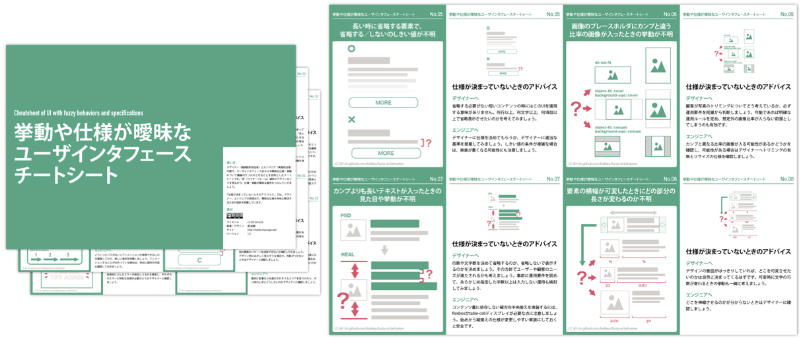
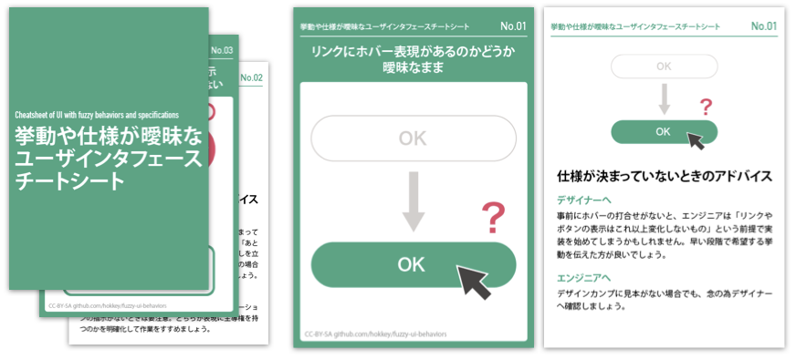

# 挙動や仕様が曖昧なユーザインタフェースチートシート

デザイナー（画面設計担当者）とエンジニア（実装担当者）の間で、ユーザインタフェースまわりの曖昧な仕様・挙動について議論のきっかけとなることを目的としたチートシートです。WF（ワイヤーフレーム）資料やデザインカンプを見ながら、仕様・挙動が曖昧な箇所をつぶしていきましょう。

「仕様が決まっていないときのアドバイス」では、デザイナー、エンジニアの両視点で、曖昧な仕様を早めに解決するための指針を記載しています。

* ラインセンス：[CC-BY-SA (4.0)／商用利用・条件付再配布が可能](https://creativecommons.org/licenses/by-sa/4.0/deed.ja)
* 執筆・デザイン：[堀 祐磨](http://media-massage.net/profile/)

## Mardown版

* [挙動や仕様が曖昧なユーザインタフェースチートシート（Markdown版）](body.md)

## 画像版

* [挙動や仕様が曖昧なユーザインタフェースチートシート（画像版）](preview.md)

## 印刷版

### [A4サイズ版PDF](pdf/layout_a4.pdf)

A4横向きのシートとして使えます。

### [A7サイズ版PDF](pdf/layout.pdf)

A7用紙の両面に印刷し、カードや小冊子として使えます。

