# 挙動や仕様が曖昧なユーザインタフェースチートシート（Markdown版）

デザイナー（画面設計担当者）とエンジニア（実装担当者）の間で、ユーザインタフェースまわりの曖昧な仕様・挙動について議論のきっかけとなることを目的としたチートシートです。WF（ワイヤーフレーム）資料やデザインカンプを見ながら、仕様・挙動が曖昧な箇所をつぶしていきましょう。

「仕様が決まっていないときのアドバイス」では、デザイナー、エンジニアの両視点で、曖昧な仕様を早めに解決するための指針を記載しています。

[※この資料の画像版・印刷版はトップページを参照してください。](README.md)

## 目次

**アニメーション**

* [リンクにホバー表現があるのかどうか曖昧なまま](#no1)
* [アニメーションの仕様を後から追加してエンジニアが困惑する](#no2)
* [素材のパスが結合されていて指示されたアニメーションが実装できない](#no3)

**CMSテンプレート**

* [出現したりしなかったりする要素で、カンプにないパターンのマージンなどが決まってない](#no4)
* [長い時に省略する要素で、省略する／しないのしきい値が不明](#no5)
* [出現したりしなかったりする要素で、カンプにないパターンのマージンなどが決まってない](#no6)
* [カンプよりも長いテキストが入ったときの見た目や挙動が不明](#no7)

**リキッドレイアウト**

* [要素の横幅が可変したときにどの部分の長さが変わるのか不明](#no8)
* [横幅可変時にグリッドが伸縮するか折り返すのか分からない](#no9)

**例外発生時の挙動**

* [フォームバリデーションのエラー文言が決まっていない](#no10)
* [Ajax通信するパーツのエラー発生時の挙動が想定されていない](#no11)
* [動的に記事などを表示するエリアで表示件数ゼロ件の時の表示が決まっていない](#no12)

## <a name="no1">リンクにホバー表現があるのかどうか曖昧なまま</a>

### 仕様が決まっていないときのアドバイス

#### デザイナーへ

事前にホバーの打合せがないと、エンジニアは「リンクやボタンの表示はこれ以上変化しないもの」という前提で実装を始めてしまうかもしれません。早い段階で希望する挙動を伝えた方が良いでしょう。

#### エンジニアへ

デザインカンプに見本がない場合でも、念の為デザイナーへ確認しましょう。

##  <a name="no2">アニメーションの仕様を後から追加してエンジニアが困惑する</a>

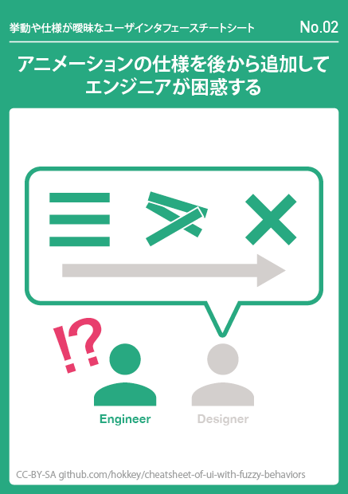

### 仕様が決まっていないときのアドバイス

####デザイナーへ

アニメーションさせたい所は、はじめから動きが決まっていた方が安全です。現時点で考えるのが難しい場合、「あとから付けようと思っている」と伝えるだけでも見通しを立てやすくなります。緊密な連携が必要な高度な表現の場合は、早めにプロトタイプを作ってもらい、実験しましょう。

#### エンジニアへ

ボタンやポップアップなど、動きそうなものにアニメーションの指示がないときは要注意。どちらが表現に主導権を持つのかを明確化して作業をすすめましょう。

##  <a name="no3">素材のパスが結合されていて指示されたアニメーションが実装できない</a>

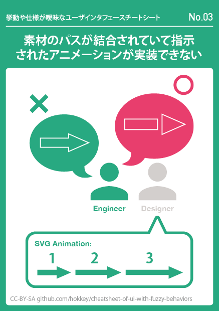

### 仕様が決まっていないときのアドバイス

#### デザイナーへ

SVGなどでは、アニメーションの挙動と素材データの作りはセットで考える必要があります。よく分からないときは事前にエンジニアと相談しましょう。できれば最初からアニメーションを想定した素材が用意されているのが理想的です。

#### エンジニアへ

どういったパスがないとアニメーションが実現できないのを整理してから、新しい素材を依頼しましょう。アニメーションすることが分かっている場合は、早めに素材の内容も確認しておきましょう。

##  <a name="no4">出現したりしなかったりする要素で、カンプにないパターンのマージンなどが決まってない</a>

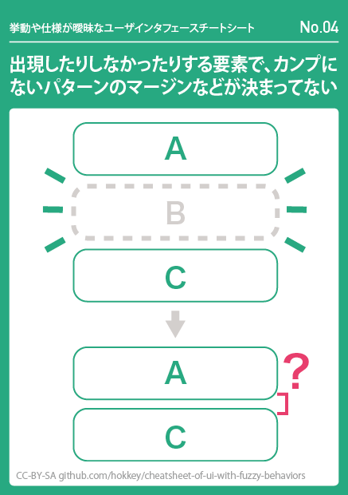

### 仕様が決まっていないときのアドバイス

#### デザイナーへ

全パターンのカンプを作るのは大変なので、その必要があるかどうか考えましょう。簡単な口頭の伝達で済む内容ならそれで十分なときもあります。

#### エンジニアへ

他の要素のパターンを流用できないか検討してみましょう。デザイン的におかしく見えそうな場合や、判断がつかないときはデザイナーと相談しましょう。

##  <a name="no5">長い時に省略する要素で、省略する／しないのしきい値が不明</a>

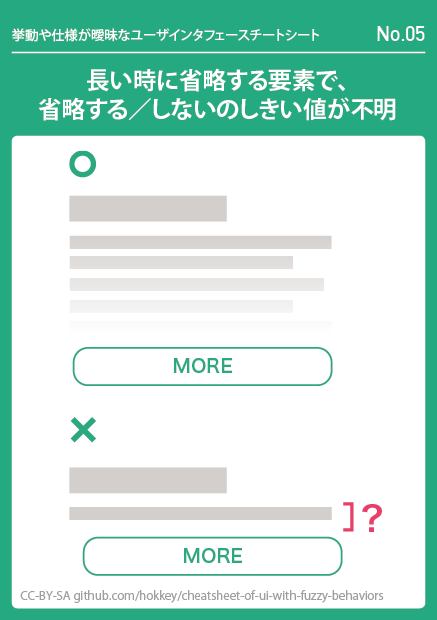

### 仕様が決まっていないときのアドバイス

#### デザイナーへ

省略する必要がない短いコンテンツの時にはこのUIを適用する意味がありません。何行以上、何文字以上、何項目以上で省略表示させたいのかを考えてみましょう。

#### エンジニアへ

デザイナーに仕様を決めてもらうか、デザイナーに適当な基準を提案してみましょう。しきい値の条件が複雑な場合は、実装が重くなる可能性にも注意しましょう。

##  <a name="no6">画像のプレースホルダにカンプと違う比率の画像が入ったときの挙動が不明</a>

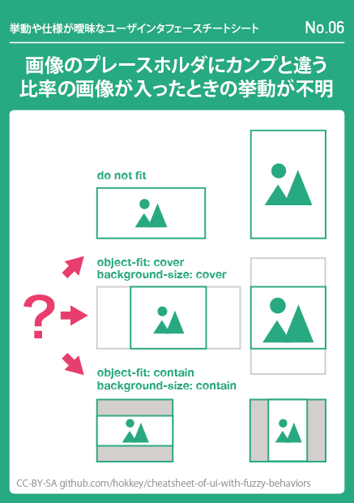

### 仕様が決まっていないときのアドバイス

#### デザイナーへ

顧客が写真のトリミングについてどう考えているか、必ず運用要件を把握から判断しましょう。可能であれば明確な運用ルールを定め、想定外の画像比率が入らない前提としてしまうのも有効です。

#### エンジニアへ

カンプと異なる比率の画像が入る可能性があるかどうかを確認し、可能性がある場合はデザイナーへトリミングの有無とリサイズの仕様を確認しましょう。

##  <a name="no7">カンプよりも長いテキストが入ったときの見た目や挙動が不明</a>

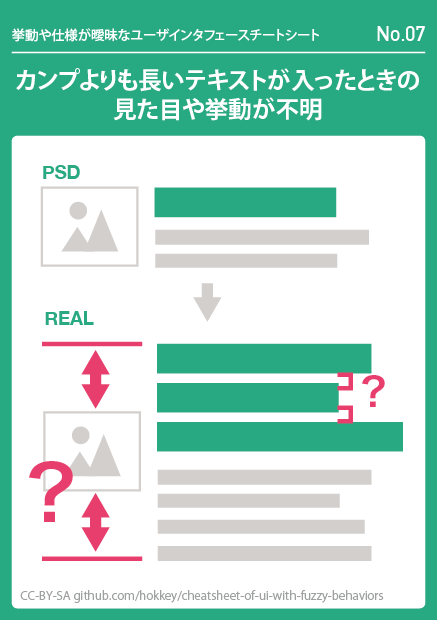

### 仕様が決まっていないときのアドバイス

#### デザイナーへ

行数や文字数を決めて省略するのか、省略しないで表示するのかを決めましょう。その方針でユーザーや顧客のニーズが満たされるかも考えましょう。事前に運用要件を固めて、あらかじめ指定した字数以上は入力しない運用も検討してみましょう.

#### エンジニアへ

コンテンツ量に依存しない縦方向中央揃えを実装するには、flexboxかtable-cellディスプレイが必要な点に注意しましょう。始めから縦揃えの仕様が変更しやすい実装にしておくと安全です。

##  <a name="no8">要素の横幅が可変したときにどの部分の長さが変わるのか不明</a>

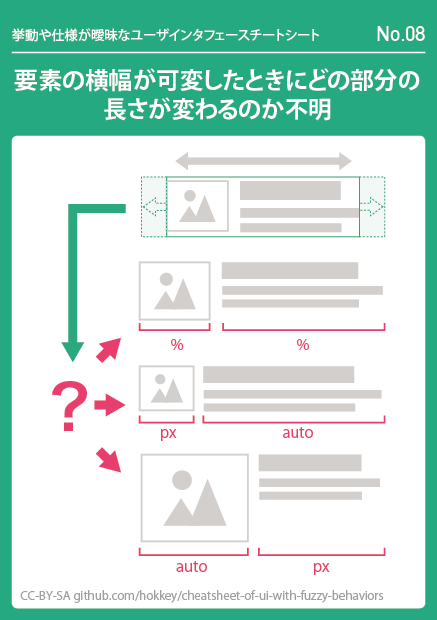

### 仕様が決まっていないときのアドバイス

#### デザイナーへ

デザインの意図がはっきりしていれば、どこを可変させたいのかは自然と決まってくるはずです。可変時に文字の行数が変わるときの挙動も一緒に考えましょう。

#### エンジニアへ

どこを伸縮させるのかが分からないときはデザイナーに確認しましょう。

##  <a name="no9">横幅可変時にグリッドが伸縮するか折り返すのか分からない</a>

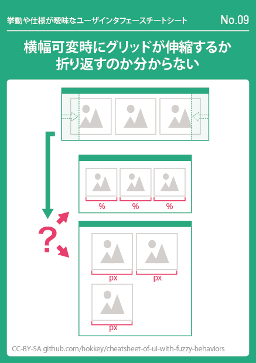

### 仕様が決まっていないときのアドバイス
   
#### デザイナーへ

デザインの意図がはっきりしていれば、どちらのタイプで可変させたいかは自然と決まってくるはずです。

#### エンジニアへ

WFの段階でデザイナーへ挙動を確認しましょう。要件上flexboxが使える場合は、それを使うとどちらのパターンにも対応しやすくなります。

##  <a name="no10">フォームバリデーションのエラー文言が決まっていない</a>

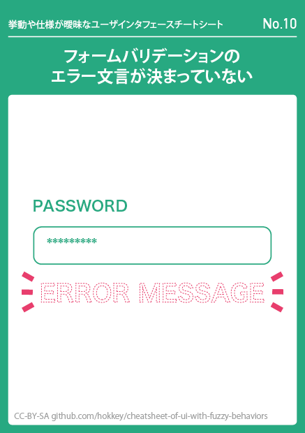

### 仕様が決まっていないときのアドバイス
   
#### デザイナーへ

発生する可能性のあるエラーを列挙して、ユーザーにとって分かりやすい文言を考えましょう。場合によっては顧客にも内容を確認してもらいましょう。フロントエンドとバックエンドの両方でバリーデーションするのが理想的ですが、工数との相談も必要です。

#### エンジニアへ

バリデーションフロントエンドでも実装する仕様なのか必ず確認しよう。フロントエンド実装の場合はどんなイベントでバリデーションが走るのかも決めましょう。正常系と異常系の両方の検証が必要なので、余裕のある検証スケジュールを確保するべきでしょう。

##  <a name="no11">Ajax通信するパーツのエラー発生時の挙動が想定されていない</a>

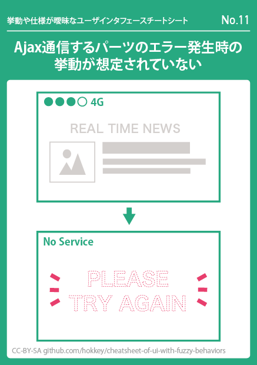

### 仕様が決まっていないときのアドバイス

#### デザイナーへ

ページ内でのパーツの優先度を鑑みた上で、エラー時にユーザーへどんなメッセージを見せるのか、あるいは見せなくても良いのかを考えてみましょう。

#### エンジニアへ

技術的にどんなエラーが発生しうるかを想定し、それぞれのエラーに特別な処理が必要かどうかデザイナーに確認しましょう。

##  <a name="no12">動的に記事などを表示するエリアで表示件数ゼロ件の時の表示が決まっていない</a>

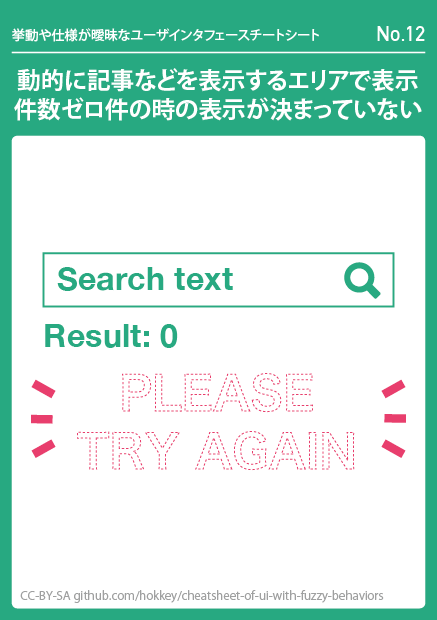

### 仕様が決まっていないときのアドバイス

#### デザイナーへ

検索結果や関連記事、新着記事などで、ゼロ件の結果になるケースがあるか考えましょう。もしありそうな場合は、代わりに何か表示するのか、あるいは何も表示しないのか挙動を考えてみましょう。

#### エンジニアへ

動的に記事などを表示されそうなエリアを見つけたら、ゼロ件のときにどうしたいのかデザイナーに確認しましょう。